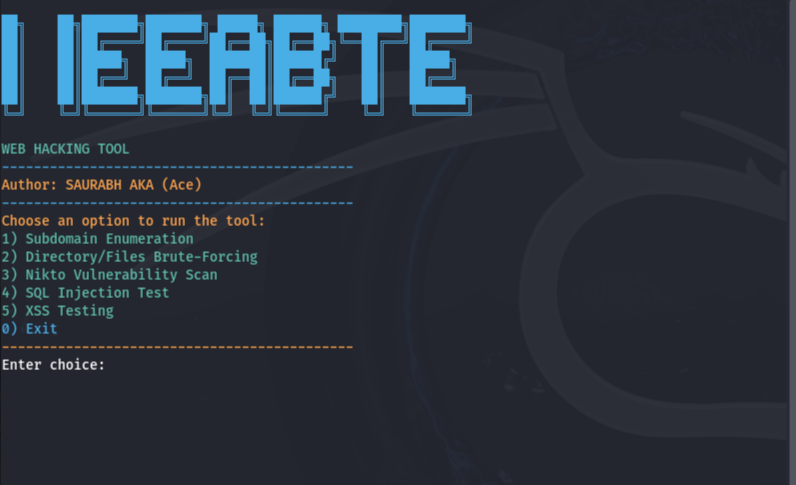

# My Awesome Project

tool installation 
* chmod +x web_tool.sh
* ./web_tool.sh

Ensure that you have git, python3, and pip3 installed on your system, as these are needed for installing dependencies for tools like XSStrike and sublist3r.
If you encounter issues with permissions, try running the script as sudo for elevated permissions.

Here is an image that shows something cool about the project:

Thank you for checking out my project!
